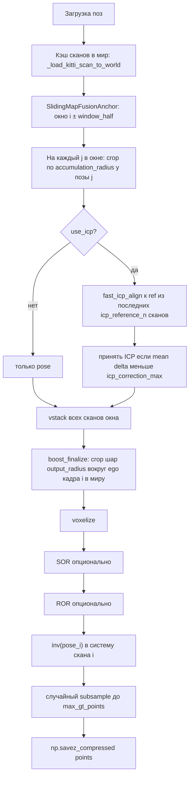

# Отчёт: `map_from_scans_boost_v2.py` (Boost 2.0)

Документ описывает назначение скрипта, внутренний пайплайн, зависимости и способы запуска. Исходный код: `data/map_from_scans_boost_v2.py`.

---

## 1. Назначение

Генерация **локальных карт полной сцены (ground truth)** для SemanticKITTI: для каждого выбранного кадра `i` строится облако точек, агрегирующее несколько соседних сканов в **мировой системе координат**, затем результат **вокселизируется**, при необходимости фильтруется (SOR/ROR) и **переводится в систему координат скана `i`**. Выход сохраняется в `.npz` с ключом `points` — в том же духе, что ожидает загрузчик датасета для обучения completion.

---

## 2. Чем Boost v2 отличается от Boost v1

| | Boost v1 (старый `map_from_scans_boost`, логика chain) | Boost v2 (anchor) |
|---|--------------------------------------------------------|-------------------|
| ICP | Часто «цепочка»: выравнивание к **предыдущему** скану в окне | **Якорь**: каждый скан выравнивается к **локальной карте** — объединению последних **N** уже обработанных сканов (`icp_reference_n`) |
| Дрифт | Накопление ошибок вдоль цепочки | Слабее: опора на короткое «окно-референс», а не на один предыдущий кадр |
| Принятие ICP | После ICP валидируется матрица (`_valid_icp`: переворот/сдвиг не огромные) | Дополнительно: если среднее смещение точек **≥ `icp_correction_max` м**, результат ICP **отбрасывается**, остаётся pose-only |

Отдельный файл `map_from_scans_boost.py` **не обязателен**: общие хелперы встроены в `map_from_scans_boost_v2.py`.

---

## 3. Зависимости

### Обязательные

- **Python 3**, **NumPy**, **tqdm**
- **`map_from_scans.py`** (в той же папке `data/`): функции **`load_poses`**, **`voxelize`** (бэкенды `numpy` / `open3d` / `torch` / `auto` / `auto_cuda`)

### Опциональные, по режиму

- **Open3D** — нужен для **`fast_icp_align`** (ICP), если не передавать **`--no-icp`**. Также предпочтителен для **SOR/ROR** (быстрее); при отсутствии Open3D для SOR/ROR используется **SciPy** (`cKDTree`).
- **PyTorch + CUDA** — если указан **`--gpu_voxelize`** и CUDA доступна, бэкенд вокселизации переключается на **`torch`** (см. `main()`).

### Входные данные на диске (на одну секвенцию `XX`)

- `sequences/XX/velodyne/*.bin`
- `sequences/XX/poses.txt` (+ при наличии `calib.txt` — как в SemanticKITTI)
- Опционально: `sequences/XX/labels/*.label` — для отсечения динамики (метки 252–259)

---

## 4. Логика пайплайна (по шагам)

Удобно мыслить **одним выходным кадром с индексом `i`** (центр окна).



1. **`load_poses`** — позы в мир с учётом калибровки Tr, если есть.
2. **`_load_kitti_scan_to_world`** — чтение `.bin`, фильтр динамики по лейблам, отрезание сферы радиуса &lt; `scan_ego_min_range_m` у лидара, при необходимости субсэмпл до `scan_load_presample_cap`, умножение на `poses[idx]` → точки в **мире**.
3. **`SlidingMapFusionAnchor`**
   - Окно индексов: \([i - \texttt{window\_half},\, i + \texttt{window\_half}]\), обрезано границами секвенции (`symmetric_window_bounds`).
   - Для каждого `j`: **`crop_window_scan_for_merge`** оставляет точки в шаре радиуса **`accumulation_radius`** вокруг позиции сенсора кадра `j` (в мире).
   - **ICP (если включён):** текущий обрезанный скан сопоставляется с **объединением последних `icp_reference_n`** уже накопленных сканов; при слишком большом среднем сдвиге берётся исходное облако (pose-only).
   - **`initialize` / `update`:** при последовательной обработке `i, i+1, ...` окно сдвигается без полной перестройки с нуля.
4. **`boost_finalize_frame_from_fused`**
   - Объединённое облако **обрезается** шаром **`output_radius`** вокруг **ego кадра `i`** в мире.
   - **`voxelize(..., voxel_size, backend)`** из `map_from_scans.py`.
   - **`sor_filter` / `ror_filter`** (Open3D или SciPy).
   - Умножение на **`inv(pose_i)`** → облако в **локальной системе кадра `i`** (как в типичном GT для обучения).
   - Случайное урезание до **`max_gt_points`**.
   - Запись **`{scan_id}{suffix}.npz`**, ключ **`points`**, `float32`.

---

## 5. Основные сущности в коде

| Имя | Роль |
|-----|------|
| `BoostDefaults` / `BOOST` | Общие дефолты: `voxel_size`, радиусы, SOR/ROR, лимиты загрузки скана, базовые ICP-параметры в `BOOST` |
| `BoostV2Defaults` / `BOOST_V2` | Специфика v2: `window_half` (по умолчанию 17 → 35 кадров в окне), `icp_reference_n`, `icp_correction_max`, `icp_downsample`, и т.д. |
| `SlidingMapFusionAnchor` | Скользящее окно + anchor ICP |
| `boost_finalize_frame_from_fused` | Кроп в мире → воксели → фильтры → в скан `i` → NPZ |
| `generate_sequence_map_boost_v2` | Цикл по секвенциям, загрузка кэша, вызов fusion + finalize |
| `main` | Разбор CLI и вызов `generate_sequence_map_boost_v2` |

---

## 6. Формат выхода

- **Каталог:** `{output_dir}/{output_subdir}/{seq}/`
- **Имя файла:** `{six_digit_scan_id}{name_suffix}.npz`  
  Пример: `001000_v2.npz` при `--name_suffix _v2` (дефолт).
- **Содержимое:** `np.load(...)["points"]` — массив **(N, 3)**, `float32`, **в системе координат LiDAR кадра `i`** (после обратной позы).

---

## 7. Вызов из командной строки

Рабочая директория обычно корень репозитория `sonata-workspace`, либо добавьте `data` в `PYTHONPATH`.

### Минимальный пример (одна секвенция, один кадр)

```bash
cd /path/to/sonata-workspace

python3 data/map_from_scans_boost_v2.py \
  -p /path/to/SemanticKITTI/dataset/sequences \
  -o /path/to/out_root \
  --output_subdir ground_truth_v2 \
  -s 00 \
  --scan_ids 001000 \
  --force
```

### ICP требует Open3D

Если в системном `python3` нет Open3D, используйте окружение с установленным пакетом, например:

```bash
/path/to/.venv_open3d/bin/python data/map_from_scans_boost_v2.py \
  -p .../sequences -o .../dataset \
  --output_subdir ground_truth_v2 -s 00 --scan_ids 001000 \
  -b open3d --force
```

### Без ICP (только позы)

```bash
python3 data/map_from_scans_boost_v2.py \
  -p .../sequences -o .../dataset \
  -s 00 --scan_ids 001000 \
  --no-icp -b numpy --force
```

### GPU-вокселизация (если есть PyTorch+CUDA)

```bash
python3 data/map_from_scans_boost_v2.py \
  -p .../sequences -o .../dataset \
  -s 00 --gpu_voxelize --force
```

### Полный список полезных аргументов CLI

| Аргумент | Смысл |
|----------|--------|
| `-p`, `--path` | Папка `.../dataset/sequences` |
| `-o`, `--output` | Корень вывода (на датасете часто сам `.../dataset`) |
| `--output_subdir` | Подпапка внутри `-o` (дефолт `ground_truth_v2`) |
| `-s`, `--sequences` | Одна или несколько секвенций: `00`, `00 01`, … |
| `--scan_ids` | Только перечисленные кадры (строки **без** `.bin`, например `000100 001000`) |
| `-v`, `--voxel_size` | Шаг вокселя (м), дефолт как в `BOOST` (0.1) |
| `-b`, `--backend` | `numpy` \| `open3d` \| `torch` \| `auto` \| `auto_cuda` |
| `--gpu_voxelize` | При CUDA переключает backend на `torch` |
| `--window_size` | Половина окна (дефолт из `BOOST_V2.window_half`, 17) |
| `--accumulation_radius` | Радиус кропа вокруг каждого кадра при слиянии (м) |
| `--output_radius` | Радиус кропа вокруг ego **текущего** кадра перед вокселизацией (м) |
| `--max_gt_points` | Максимум точек в сохранённом облаке |
| `--name_suffix` | Суффикс в имени файла (дефолт `_v2`) |
| `--force` | Перезаписывать существующие NPZ |
| `--no-icp` | Отключить ICP |
| `--no-sor` / `--no-ror` | Отключить фильтры |
| `--icp-reference-n` | Сколько последних сканов в референс для ICP |
| `--icp-correction-max` | Порог среднего сдвига (м) для принятия ICP |
| `--icp-max-iter`, `--icp-threshold`, `--icp-downsample` | Параметры Open3D ICP |
| `--quiet` | Меньше вывода |

---

## 8. Вызов из Python

```python
from pathlib import Path
import sys
sys.path.insert(0, str(Path("data").resolve()))  # при запуске из корня проекта

import map_from_scans_boost_v2 as b2

b2.generate_sequence_map_boost_v2(
    seq_path="/path/to/dataset/sequences",
    output_dir="/path/to/dataset",
    sequences=["00"],
    output_subdir="ground_truth_v2",
    scan_ids_filter={"001000"},
    force=True,
    use_icp=True,   # False если нет open3d
    backend="open3d",
)
```

---

## 9. Проверка результата

- Загрузка: `pts = np.load(".../001000_v2.npz")["points"]`
- Визуализация: конвертация в PLY (ASCII или через Open3D) и просмотр в MeshLab / CloudCompare / Open3D.

---

## 10. Типичные замечания

- **Размер облака** с ICP и без может отличаться: меняется геометрия слияния и последующий кроп/воксели.
- **Имена кадров**: SemanticKITTI использует **6 цифр** (`001000`, не `1000`).
- При **`--scan_ids`** в память грузятся все индексы из объединения окон вокруг запрошенных кадров (см. лог `Loading ... scans`), а не вся секвенция — это ускоряет точечные прогоны.

---

*Документ соответствует версии кода в `data/map_from_scans_boost_v2.py` в репозитории sonata-workspace.*
